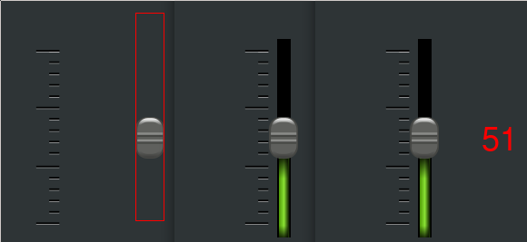

This is a little C-SDL2 Tutorial how to make a slider.  
It is a follow up from [Mousegrab](https://github.com/Acry/SDL2-Mousegrab).  
It mainly about:  
Render and change a string with SDL-TTF using 
Normalization (the process of changing  
the scale of the data range).  

Useful links:  
[SDL2](https://www.libsdl.org/) [SDL-Discourse](https://discourse.libsdl.org) [Example Code](https://gist.github.com/Acry/baa861b8e370c6eddbb18519c487d9d8)

Screenshot:  

Assets  
[Button](https://openclipart.org/detail/184819/black-slider)  
[NimbusSanL-Regular](https://fontlibrary.org/en/font/nimbus-sans-l)  

[Get in touch on SDL-Discourse](https://discourse.libsdl.org/u/Acry/summary)
